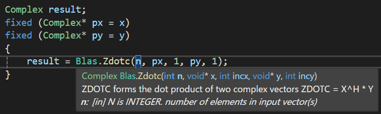

# OpenBlasSharp

The purpose of this project is to provide a .NET wrapper for [OpenBLAS](https://github.com/OpenMathLib/OpenBLAS).


## Features

* Auto-generated thin wrapper for C# with no special marshalling.
* Covers BLAS, LAPACK, and OpenBLAS-specific functions.
* Most functions and arguments are annotated with doc comments taken from the original FORTRAN code.
This is very helpful when working with the BLAS and LAPACK functions, which often require a large number of arguments.




## Installation

[The NuGet package](https://www.nuget.org/packages/OpenBlasSharp) is available.

```ps1
Install-Package OpenBlasSharp
```

This package does not include the native binary.
[The `OpenBlasSharp.Windows` package](https://www.nuget.org/packages/OpenBlasSharp.Windows) provides the native binary for Windows.

```ps1
Install-Package OpenBlasSharp.Windows
```

Or, [download the compiled binary](https://github.com/OpenMathLib/OpenBLAS/releases) and put `libopenblas.dll` in the same directory as the executable file.
Binaries for both x86 and x64 architectures are supported, but [the ILP64 build with the `x64-64` suffix](https://github.com/OpenMathLib/OpenBLAS/blob/develop/docs/distributing.md#ilp64-interface-builds) is not supported.

All the classes are in the `OpenBlasSharp` namespace.

```cs
using OpenBlasSharp;
```


## BLAS Examples

BLAS functions are provided as static methods of the `Blas` class.

### Dot Product

```cs
var len = 3;

var rnd = new Random(42);
var x = Enumerable.Range(0, len).Select(i => rnd.NextDouble()).ToArray();
var y = Enumerable.Range(0, len).Select(i => rnd.NextDouble()).ToArray();

fixed (double* px = x)
fixed (double* py = y)
{
    // Calculate x^T * y.
    var result = Blas.Ddot(len, px, 1, py, 1);
}
```

### Matrix Multiplication

```cs
var m = 3;
var n = 5;
var k = 4;

var rnd = new Random(42);
var a = Enumerable.Range(0, m * k).Select(i => rnd.NextDouble()).ToArray();
var b = Enumerable.Range(0, k * n).Select(i => rnd.NextDouble()).ToArray();
var c = new double[m * n];

fixed (double* pa = a)
fixed (double* pb = b)
fixed (double* pc = c)
{
    // Calculate c = a * b.
    Blas.Dgemm(
        Order.ColMajor,
        Transpose.NoTrans,
        Transpose.NoTrans,
        m, n, k,
        1.0,
        pa, m,
        pb, k,
        0.0,
        pc, m);
}
```


## LAPACK Examples

LAPACK functions are provided as static methods of the `Lapack` class.

### Inverse Matrix using LU Decomposition

```cs
var n = 3;

var random = new Random(42);
var a = Enumerable.Range(0, n * n).Select(i => random.NextDouble()).ToArray();
var piv = new int[n];

fixed (double* pa = a)
fixed (int* ppiv = piv)
{
    Lapack.Dgetrf(
        MatrixLayout.ColMajor,
        n, n,
        pa, n,
        ppiv);

    Lapack.Dgetri(
        MatrixLayout.ColMajor,
        n,
        pa, n, // pa will be the inverse matrix.
        ppiv);
}
```

### Singular Value Decomposition

```cs
var m = 4;
var n = 3;

var rnd = new Random(42);
var a = Enumerable.Range(0, m * n).Select(i => rnd.NextDouble()).ToArray();
var s = new double[Math.Min(m, n)];
var u = new double[m * m];
var vt = new double[n * n];
var work = new double[Math.Min(m, n) - 1];

fixed (double* pa = a)
fixed (double* ps = s)
fixed (double* pu = u)
fixed (double* pvt = vt)
fixed (double* pwork = work)
{
    Lapack.Dgesvd(
        MatrixLayout.ColMajor,
        'A', 'A',
        m, n,
        pa, m, // Note that pa will be destroyed.
        ps,
        pu, m,
        pvt, n,
        pwork);
}
```


## OpenBLAS-specific functions

OpenBLAS-specific functions are provided as static methods of the `OpenBlas` class.

```cs
var numThreads = OpenBlas.GetNumThreads();
var numProcs = OpenBlas.GetNumProcs();
var config = OpenBlas.GetConfig();
```


## Limitations

* There are no plans to support low-level LAPACK functions with the `work` suffix.
* LAPACK functions that require function pointers are currently not supported, but support is planned for the future.
* The doc comments in the original FORTRAN code do not completely align with the C API of OpenBLAS, so the annotations for some APIs are incomplete.


## License
OpenBlasSharp is available under [the BSD-3-Clause license](LICENSE.txt).
